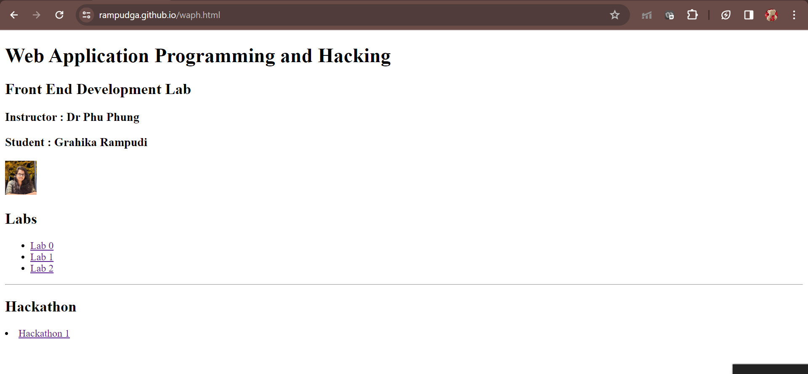
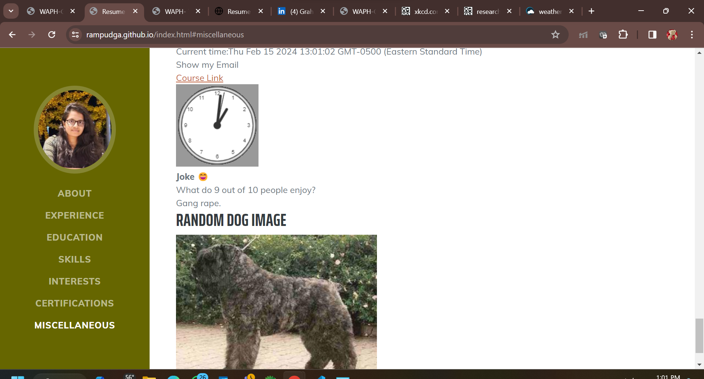

# WAPH-Web Application Programming and Hacking

## Instructor: Dr. Phu Phung

## Student

**Name**: Grahika Rampudi

**Email**: rampudga@mail.uc.edu


## Project 1 - Professional HomePage

**Overview**: In this project,I expand front-end web development skills by developing a Professional Profile Website and deploying it on github.io cloud service. This project has general, non-technical, and technical requirements like preparing github.io, displaying portfolio with BootStrap, adding few javascript functionalities. index.html is the main page where it contains 7 tabs which has about, experience, education, skills, interests, certifications, miscllaneous.


Link to the repository:
[https://github.com/rampudga/rampudga.github.io/blob/main/README.md](https://github.com/rampudga/rampudga.github.io/blob/main/README.md)

Link to the portfolio:
[https://rampudga.github.io/index.html](https://rampudga.github.io/index.html)

\pagebreak

### Task 1 : General Requirements
 -Created a "rampudga.github.io" personal website where this includes basic profile details of me with no styling. [https://rampudga.github.io/resume.html](https://rampudga.github.io/resume.html)

 

- Created a course link in index.html page in miscllaneous tab where it displays all the course work till now in WAPH course i.e all labs and hackathon reports pdfs.



\pagebreak
### Task 2 : Non-technical Requirements
- Used a open source boootstrap template including page tracker. In Portfolio added few sections which focuses on the profile as part of job applicationwhich includes about, experience, education, skills, interests, certifications, miscllaneou sections.


- In page tracker google analytics is used which helps to track the visitors number with location and device.

```JS
<script async src="https://www.googletagmanager.com/gtag/js?id=G-Z3PFRKP3DC"></script>
    <script>
        window.dataLayer = window.dataLayer || [];
        function gtag() { dataLayer.push(arguments); }
        gtag('js', new Date());

        gtag('config', 'G-Z3PFRKP3DC');
    </script>
```


## Technical Requirements

### Task 1 : Basic Javascript Code
In Miscellaneous tab I added digital clock, analog clock, show or hide email, and from different feature named greeting which used to greet at the start of the page like "GOOD MORNING", "GOOD AFTERNOON" , "GOOD EVENING", based on the time hour. It displays as an alert and then it displays on the page.
```JS
// greetings.js
const Greeting = () => {
  const hour = new Date().getHours();
  let greetingMessage;

  if (hour >= 5 && hour < 12) {
    alert(greetingMessage = 'Good morning!');
  } else if (hour >= 12 && hour < 17) {
    alert(greetingMessage = 'Good afternoon!');
  } else {
    alert(greetingMessage = 'Good evening!');
  }

  return React.createElement('h2', null, greetingMessage);
};

ReactDOM.render(React.createElement(Greeting, null), document.getElementById('greeting-root'));
```

### Task 2 : Public WEB APIs Integration
1. Integrated joke APi which updates every 1 min automatically. [https://v2.jokeapi.dev/joke/Any](https://v2.jokeapi.dev/joke/Any) 
```JS
       <b>Joke &#x1F604;</b>
                <div id="joke"></div>
                
                <script>
                
                    // Function to fetch and display a joke
                    function fetchJoke() {
                        fetch('https://v2.jokeapi.dev/joke/Any')
                            .then(response => response.json())
                            .then(data => {
                                // Check if the joke is a single joke or a setup and delivery
                                const joke = data.type === 'single' ? data.joke : `${data.setup}<br>${data.delivery}`;
                                // Display the joke
                                document.getElementById('joke').innerHTML = joke;
                            })
                            .catch(error => {
                                console.error('Error fetching joke:', error);
                            });
                    }
            
                    // Fetch a joke immediately when the page loads
                    fetchJoke();
            
                    // Fetch a new joke every 1 minute
                    setInterval(fetchJoke, 60000);
                </script>
```
2. Integrated a public api of random dogs which gets a new dogg image every time. Used [https://dog.ceo/api/breeds/image/random](https://dog.ceo/api/breeds/image/random)

```JS
<h3>Random Dog Image</h3>
                
            
                <script>
                    fetch('https://dog.ceo/api/breeds/image/random')
                        .then(response => response.json())
                        .then(data => {
                            const dogImage = document.getElementById('dog-image');
                            dogImage.src = data.message;
                        })
                        .catch(error => console.error('Error fetching data:', error));
                </script>
```


## Cookies Integration
-Used setCookie(), getCookie() to set an ddisplay the message "welcome to my portfolio" and "welcome! Your Last Vist with date".
```JS
<script>
//other script
<div id1="greetingCookie">Hello</div>
//other script
     function setCookie(name, value, expiryDays) {
            const d = new Date();
            d.setTime(d.getTime() + (expiryDays*24*60*60*1000));
            let expires = "expires="+ d.toUTCString();
            document.cookie = name + "=" + value + ";" + expires + ";path=/";
        }

        function getCookie(name) {
            let cookName = name + "=";
            let decodedCookie = decodeURIComponent(document.cookie);
            let ca = decodedCookie.split(';');
            for(let i = 0; i <ca.length; i++) {
                let c = ca[i];
                while (c.charAt(0) == ' ') {
                    c = c.substring(1);
                }
                if (c.indexOf(cookName) == 0) {
                    return c.substring(cookName.length, c.length);
                }
            }
            return "";
        }

        function welcomeUser() {
            const lastVis = getCookie("lastVis");
            const greetEle = document.getElementById("greetingCookie");
            if (lastVis) {
                greetEle.innerHTML = "Welcome back! Your last visit was on " + lastVis + ".";
            } else {
                greetEle.innerHTML = "Welcome to my portfolio!";
            }
            const now = new Date();
            setCookie("lastVis", now.toLocaleString(), 365);
        }

        welcomeUser();
```

